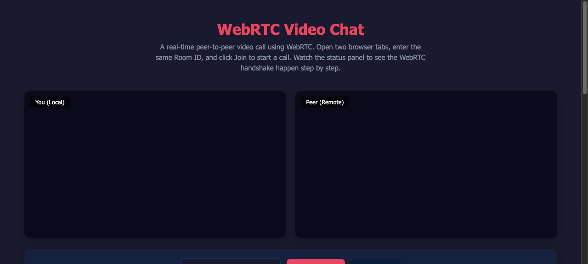

# WebRTC Video Chat


**WebRTC(Web Real-Time Communication)**를 사용한 1:1 화상 채팅 애플리케이션입니다.
코드를 읽으면서 WebRTC가 어떻게 동작하는지 단계별로 이해할 수 있도록 설계했습니다.

## Demo



## 30초 데모

```bash
./gradlew bootRun
```

브라우저 탭 2개에서 `http://localhost:8080` 접속 → 같은 Room ID 입력 → **화상 통화 시작!**

## WebRTC란?

**브라우저 간 직접(P2P) 영상/음성 통신 기술**입니다.

```
일반적인 화상회의 (서버 경유):
  You ──── 영상 ────→ 서버 ──── 영상 ────→ Peer
  ↑                                        │
  └──────── 영상 ←──── 서버 ←──── 영상 ────┘

  문제: 서버 대역폭 비용 ↑, 지연시간 ↑

WebRTC (P2P 직접 연결):
  You ←──────── 영상/음성 ────────→ Peer

  장점: 서버 비용 ↓, 지연시간 ↓, 보안 ↑ (E2E 암호화)
```

**그렇다면 서버가 왜 필요한가?**

브라우저는 상대방의 IP 주소를 모릅니다.
"시그널링 서버"가 양측을 소개시켜주는 역할을 합니다.
**연결이 수립되면 서버는 더 이상 필요하지 않습니다.**

## 연결 과정 (5단계)

```mermaid
sequenceDiagram
    participant A as Browser A
    participant S as Signaling Server<br/>(Spring Boot WebSocket)
    participant B as Browser B

    Note over S: 서버는 "소개팅 주선자" 역할만 한다

    A->>S: 1. join(roomId: "abc")
    B->>S: 1. join(roomId: "abc")
    S->>A: ready (상대방 입장)
    S->>B: ready (상대방 입장)

    Note over A: 2. SDP Offer 생성<br/>"나는 H.264 코덱 지원하고<br/>해상도 1280x720 가능해"
    A->>S: offer(SDP)
    S->>B: offer(SDP) [그대로 전달]

    Note over B: 3. SDP Answer 생성<br/>"나도 H.264 되고<br/>720p OK"
    B->>S: answer(SDP)
    S->>A: answer(SDP) [그대로 전달]

    Note over A,B: 4. ICE Candidates 교환<br/>"내 IP는 192.168.1.5야"<br/>"내 공인 IP는 203.x.x.x야"
    A->>S: ice-candidate
    S->>B: ice-candidate [전달]
    B->>S: ice-candidate
    S->>A: ice-candidate [전달]

    Note over A,B: 5. P2P 연결 수립!<br/>이제 서버 없이 직접 통신

    A<-->B: 영상/음성 직접 전송 (SRTP 암호화)

    Note over S: 서버는 영상 데이터를<br/>절대 보지 않는다
```

### 각 단계 상세 설명

| 단계 | 무엇을 | 왜 |
|------|--------|-----|
| **1. Signaling** | WebSocket으로 시그널링 서버에 연결 | 브라우저끼리 직접 연락할 방법이 없으므로 중개자 필요 |
| **2. SDP Offer** | 내가 지원하는 코덱, 해상도, 미디어 정보 전송 | 상대방과 호환되는 미디어 설정을 협상하기 위해 |
| **3. SDP Answer** | 상대방이 수락 가능한 설정으로 응답 | 양측이 동일한 코덱/해상도로 합의 |
| **4. ICE Candidates** | 네트워크 경로 후보 교환 | NAT/방화벽 뒤에서도 연결 가능한 최적 경로 탐색 |
| **5. P2P Connected** | DTLS 핸드셰이크 후 SRTP로 미디어 전송 | 서버 경유 없이 직접 암호화된 통신 |

### ICE란?

**Interactive Connectivity Establishment** — 최적의 네트워크 경로를 찾는 과정입니다.

```
시도 순서 (빠른 것부터):

1순위: Host Candidate (같은 네트워크)
   You ←──── LAN ────→ Peer
   지연: ~1ms

2순위: Server Reflexive (STUN 서버로 공인 IP 확인)
   You ←── Internet ──→ Peer
   STUN 서버: "너의 공인 IP는 203.x.x.x야"
   지연: ~30ms

3순위: Relay (TURN 서버 경유 — 최후 수단)
   You ←→ TURN Server ←→ Peer
   지연: ~100ms, 서버 비용 발생
```

## Architecture

```
┌──────────────────────────────────────────────┐
│              Spring Boot (:8080)              │
│                                              │
│  ┌──────────────────┐  ┌──────────────────┐  │
│  │  Static Files     │  │  WebSocket       │  │
│  │  index.html       │  │  /ws/signaling   │  │
│  │  webrtc.js        │  │                  │  │
│  │  style.css        │  │  SignalingHandler │  │
│  │                   │  │  - join/leave     │  │
│  │  GET /            │  │  - relay offer    │  │
│  │                   │  │  - relay answer   │  │
│  │                   │  │  - relay ICE      │  │
│  └──────────────────┘  └──────────────────┘  │
│                                              │
│  ┌──────────────────────────────────────┐    │
│  │  Room Manager                        │    │
│  │  ConcurrentHashMap<roomId, Room>     │    │
│  │  Room = max 2 WebSocketSessions      │    │
│  └──────────────────────────────────────┘    │
└──────────────────────────────────────────────┘
          │                      │
    HTTP (static)         WebSocket (signaling)
          │                      │
┌─────────┴──────────────────────┴─────────────┐
│              Browser A                        │
│  getUserMedia() → 카메라/마이크 접근           │
│  RTCPeerConnection → P2P 연결 관리            │
│  createOffer/Answer → SDP 협상                │
│  addIceCandidate → 네트워크 경로 교환         │
└───────────────────────┬──────────────────────┘
                        │
                   P2P (SRTP)
                   영상/음성 직접 전송
                   서버를 거치지 않음
                        │
┌───────────────────────┴──────────────────────┐
│              Browser B                        │
└──────────────────────────────────────────────┘
```

## 코드 핵심 포인트

### 시그널링 서버 (Java)

```java
// SignalingHandler.java — 서버는 메시지를 "전달"만 한다
// 영상/음성 데이터는 절대 서버를 거치지 않는다

@Override
protected void handleTextMessage(WebSocketSession session, TextMessage message) {
    JsonNode json = objectMapper.readTree(message.getPayload());
    String type = json.get("type").asText();

    switch (type) {
        case "join"          -> handleJoin(session, json);
        case "offer"         -> relayToPeer(session, message);  // 그대로 전달
        case "answer"        -> relayToPeer(session, message);  // 그대로 전달
        case "ice-candidate" -> relayToPeer(session, message);  // 그대로 전달
        case "leave"         -> handleLeave(session);
    }
}
```

### WebRTC 클라이언트 (JavaScript)

```javascript
// webrtc.js — P2P 연결 수립의 핵심

// 1. 카메라 접근
const stream = await navigator.mediaDevices.getUserMedia({ video: true, audio: true });

// 2. P2P 연결 객체 생성 (STUN 서버로 공인 IP 확인)
const pc = new RTCPeerConnection({
    iceServers: [{ urls: 'stun:stun.l.google.com:19302' }]
});

// 3. 내 영상을 P2P 연결에 추가
stream.getTracks().forEach(track => pc.addTrack(track, stream));

// 4. 상대방 영상 수신 시 화면에 표시
pc.ontrack = (event) => {
    remoteVideo.srcObject = event.streams[0];
};

// 5. ICE candidate 발견 시 시그널링으로 전달
pc.onicecandidate = (event) => {
    if (event.candidate) {
        ws.send(JSON.stringify({ type: 'ice-candidate', candidate: event.candidate }));
    }
};
```

## Project Structure

```
src/main/
├── java/com/webrtc/
│   ├── WebRtcApplication.java
│   ├── config/
│   │   └── WebSocketConfig.java       # WebSocket 엔드포인트 등록
│   └── signaling/
│       ├── SignalingHandler.java       # 시그널링 서버 (메시지 중계)
│       └── Room.java                  # 방 관리 (최대 2명)
└── resources/
    ├── static/
    │   ├── index.html                 # 데모 UI (교육용 상태 패널 포함)
    │   ├── js/webrtc.js               # WebRTC 클라이언트 (상세 주석)
    │   └── css/style.css              # 다크 테마 스타일
    └── application.yml

src/test/
└── java/com/webrtc/signaling/
    └── SignalingHandlerTest.java       # 시그널링 로직 테스트 (6건)
```

## Quick Start

```bash
# 실행
./gradlew bootRun

# 브라우저 2개 탭에서 접속
open http://localhost:8080

# 같은 Room ID 입력 → Join → 화상 통화!
```

**요구사항:** 카메라/마이크가 있는 환경 (노트북 내장 카메라 OK)

### 같은 PC에서 테스트하려면

1. 탭 1: `http://localhost:8080` → Room ID: `test` → Join
2. 탭 2: `http://localhost:8080` → Room ID: `test` → Join
3. 양쪽 카메라 허용 → 자동 연결

### 다른 기기에서 테스트하려면

같은 네트워크의 다른 기기에서 `http://{PC의_IP}:8080` 접속

## 용어 정리

| 용어 | 설명 |
|------|------|
| **WebRTC** | Web Real-Time Communication. 브라우저 간 P2P 통신 표준 |
| **SDP** | Session Description Protocol. 지원 코덱/해상도 등 미디어 협상 정보 |
| **ICE** | Interactive Connectivity Establishment. 최적 네트워크 경로 탐색 |
| **STUN** | Session Traversal Utilities for NAT. 공인 IP를 알려주는 서버 |
| **TURN** | Traversal Using Relays around NAT. P2P 불가 시 중계 서버 |
| **Signaling** | P2P 연결 전 SDP/ICE 정보를 교환하는 과정 (이 프로젝트의 서버 역할) |
| **Offer/Answer** | SDP 협상 패턴. 한쪽이 Offer를 보내면 상대방이 Answer로 응답 |
| **P2P** | Peer-to-Peer. 서버 없이 기기 간 직접 통신 |
| **SRTP** | Secure Real-time Transport Protocol. 암호화된 미디어 전송 |

## Tech Stack

| Category | Technology |
|----------|-----------|
| **Backend** | Java 17, Spring Boot 3.3.4 |
| **Signaling** | Spring WebSocket (TextWebSocketHandler) |
| **Frontend** | Vanilla HTML/CSS/JavaScript (No framework) |
| **WebRTC** | RTCPeerConnection, getUserMedia, MediaStream API |
| **STUN** | Google Public STUN (stun:stun.l.google.com:19302) |
| **Build** | Gradle 8.10 |

## License

This project is for portfolio and educational purposes.
